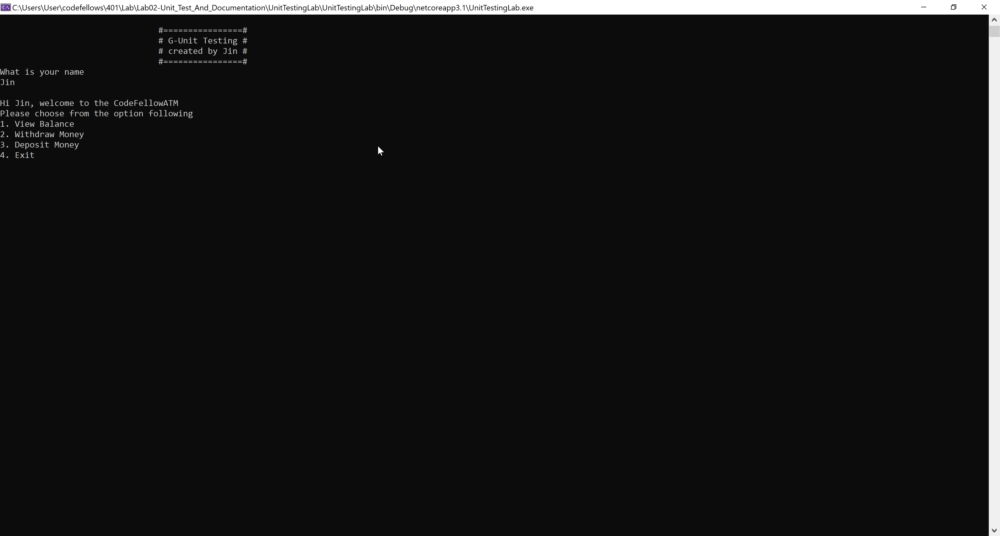
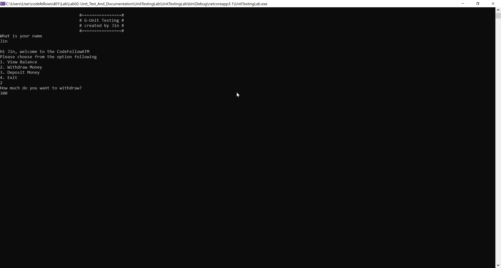
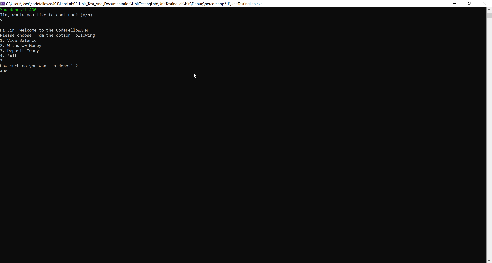
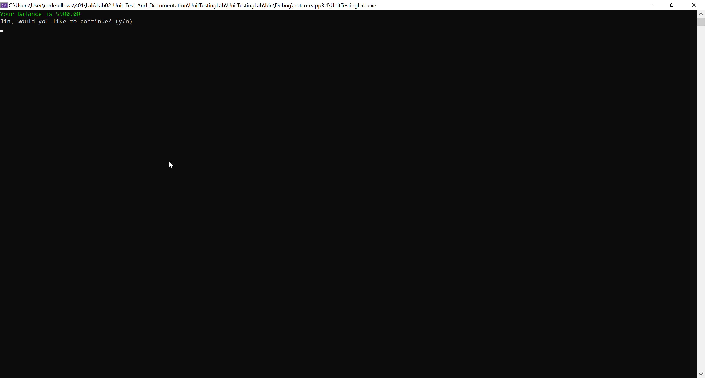
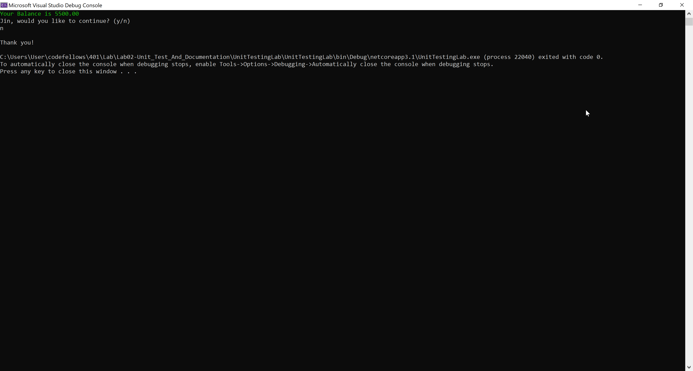

# G-unit Banking Application


Lab02-Unit Test and documentation

*Author: Jin Kim*

----

## Description

This is C# console application that let the user have default money of 5000 and let them withdraw/deposit and check their current balance. It doesn't allow overdraft nor put negative value for each options.

---
## Dependencies

- [Git](https://git-scm.com/)
- Terminal/ Command line
- [.Net Core SDK](https://dotnet.microsoft.com/download)
- [Visual Studio](https://docs.microsoft.com/en-us/visualstudio/releases/2019/release-notes)

---
### Getting Started
Clone this repository to your local machine using terminal(macOS), command line(Window).

```
$ git clone [repo clone url here]
```

### To run the program from Visual Studio:
Select ```File``` -> ```Open``` -> ```Project/Solution```

Next navigate to the location you cloned the Repository.

Double click on the ```Lab02-Unit_Test_And_Documentation``` directory.

In the `Lab02-Unit_Test_And_Documentation`, navigate further into `UnitTestingLab`

Then select and open ```UnitTestingLab.sln```

### To Run the program from Command Line/ Terminal
After clonning the file, navigate to `Lab02-Unit_Test_And_Documentation`

Navigate further into `UnitTestingLab` ->`UnitTestingLab`

Type in `dotnet run` and console will prompt you with options.

---

### Visuals

#### Application Start

When Application starts

#### Withdrawing

Withdrawing the Money

#### Deposit

Deposit money into account

#### Checking Balance

Checking Balance

#### Application End

End Application

---

### Change Log
1.3: *Created unit test to test everything* - March 18 2020  
1.2: *Added try/catch/finally block to insure that environment doesn't exit out suddenly* - March 18 2020  
1.1: *Implemented interface and created methods that works with the interface* - March 18 2020  
1.0: *Created Repo, structuralized the application* - March 18 2020  

